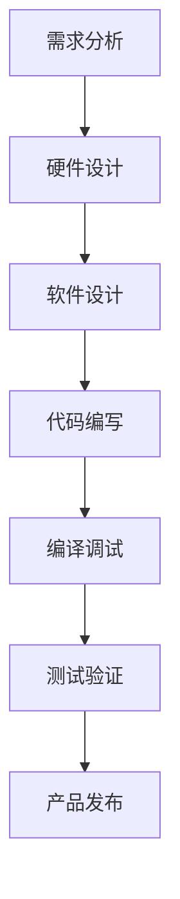

## 什么是STM32？

STM32是意法半导体（STMicroelectronics）推出的基于ARM Cortex-M内核的微控制器系列。它以其高性能、低功耗和丰富的外设而广受欢迎。

## STM32开发环境

### 1. 开发工具

- **STM32CubeMX**：图形化配置工具
- **Keil MDK**：集成开发环境
- **STM32CubeIDE**：免费的集成开发环境
- **ST-Link**：调试器和编程器

### 2. 开发流程



## GPIO编程

GPIO（通用输入输出）是最基础的外设：

```c
#include "stm32f1xx_hal.h"

// 初始化GPIO
void GPIO_Init(void) {
    GPIO_InitTypeDef GPIO_InitStruct = {0};
    
    // 使能GPIOA时钟
    __HAL_RCC_GPIOA_CLK_ENABLE();
    
    // 配置PA5为推挽输出
    GPIO_InitStruct.Pin = GPIO_PIN_5;
    GPIO_InitStruct.Mode = GPIO_MODE_OUTPUT_PP;
    GPIO_InitStruct.Pull = GPIO_NOPULL;
    GPIO_InitStruct.Speed = GPIO_SPEED_FREQ_LOW;
    HAL_GPIO_Init(GPIOA, &GPIO_InitStruct);
}

// 控制LED
void LED_Toggle(void) {
    HAL_GPIO_TogglePin(GPIOA, GPIO_PIN_5);
}
```

## 定时器编程

定时器用于产生精确的时间延迟：

```c
TIM_HandleTypeDef htim2;

void TIM2_Init(void) {
    __HAL_RCC_TIM2_CLK_ENABLE();
    
    htim2.Instance = TIM2;
    htim2.Init.Prescaler = 7200 - 1;
    htim2.Init.CounterMode = TIM_COUNTERMODE_UP;
    htim2.Init.Period = 10000 - 1;
    htim2.Init.ClockDivision = TIM_CLOCKDIVISION_DIV1;
    htim2.Init.AutoReloadPreload = TIM_AUTORELOAD_PRELOAD_DISABLE;
    HAL_TIM_Base_Init(&htim2);
}

// 定时器中断回调
void HAL_TIM_PeriodElapsedCallback(TIM_HandleTypeDef *htim) {
    if (htim->Instance == TIM2) {
        // 定时器中断处理
        LED_Toggle();
    }
}
```

## 串口通信

串口是最常用的通信接口：

```c
UART_HandleTypeDef huart1;

void UART1_Init(void) {
    huart1.Instance = USART1;
    huart1.Init.BaudRate = 115200;
    huart1.Init.WordLength = UART_WORDLENGTH_8B;
    huart1.Init.StopBits = UART_STOPBITS_1;
    huart1.Init.Parity = UART_PARITY_NONE;
    huart1.Init.Mode = UART_MODE_TX_RX;
    huart1.Init.HwFlowCtl = UART_HWCONTROL_NONE;
    huart1.Init.OverSampling = UART_OVERSAMPLING_16;
    HAL_UART_Init(&huart1);
}

// 发送字符串
void UART_SendString(char *str) {
    HAL_UART_Transmit(&huart1, (uint8_t *)str, strlen(str), HAL_MAX_DELAY);
}
```

## 实战项目：LED闪烁

让我们创建一个完整的LED闪烁项目：

```c
#include "stm32f1xx_hal.h"

int main(void) {
    HAL_Init();
    SystemClock_Config();
    GPIO_Init();
    
    while (1) {
        LED_Toggle();
        HAL_Delay(500);  // 延时500ms
    }
}
```

## 调试技巧

1. **使用断点**：在关键代码处设置断点
2. **观察变量**：实时查看变量值
3. **串口输出**：通过串口打印调试信息
4. **示波器**：观察信号波形

## 总结

STM32是嵌入式开发的理想选择。通过本文的学习，你已经了解了STM32的基础知识。继续实践，你会掌握更多高级功能！
